# MVP — Impacto Econômico da Guerra de 2023–2024 sobre a Atividade Comercial em Israel, Cisjordânia e Gaza

**Autor:** Laís Sankari Nogueira Ribeiro

**Plataforma de nuvem:** Databricks Free Edition (Lakehouse com Delta Lake e Unity Catalog)

**Linguagem do pipeline:** SQL (Databricks SQL), organizado na Arquitetura Medalhão
]


## Resumo:

| Pergunta | Status | Achado principal |
|---|---|---|
| 1. Variação do PIB | Respondida | Israel desacelerou mas cresceu (+0,95% em 2024); Cisjordânia e Gaza combinados caíram −22,86%; no Q1-2024, Gaza sozinha caiu −86% |
| 2. Setores mais/menos afetados |  Respondida | Construção foi o mais afetado na Cisjordânia (−42%); em Gaza, todos os setores caíram mais de −60%, sem "setor poupado" |
| 3. Evolução do desemprego | Respondida (exceto Gaza pós-2022) | Desemprego caiu em Israel (3,4%→3,0%) e mais que dobrou na Cisjordânia (13,1%→31,3%); Gaza parou de publicar as informações a partir de 2023. |
| 4. Negócios afetados | Respondida via proxy (só Israel) | Negócios em emprego mínimo caíram de 37% para 22% em um mês; Sul e Norte foram os mais afetados e os que menos recuperaram. Não foi possível achar dados com essas informações sobre a Cisjordânia e Gaza após 2022.  |
| 5. Correlação com o conflito | Parcial | Ausência do trabalho em Israel saltou +134% no mês da guerra, embora o desemprego formal não tenha refletido isso; correlação estatística com a intensidade do conflito ficou como trabalho futuro |

Pipeline em SQL, arquitetura Bronze/Silver/Gold, 6 fontes ingeridas (mais 1 citada sem ingestão por questão de licença), constelação de 3 fatos na camada Gold.

## Sumário

- [Contexto de Negócios e Perguntas](#contexto)
- [Carga dos Dados](#carga)
- [Modelagem e Catálogo de Dados](#modelagem)
- [Pipeline de Dados](#pipeline)
- [Qualidade de Dados](#qualidade)
- [Análise de Dados](#analise)
- [Autoavaliação](#autoavaliacao)
- [Referências](#referencias)


<a id="contexto"></a>
### 1. Contexto de Negócios e Perguntas (Etapa 2 e 4.1)

**1.1 Contexto**

A guerra que eclodiu em outubro de 2023 afetou as economias de Israel, da Cisjordânia e da Faixa de Gaza de formas diferentes. O objetivo deste trabalho é medir, com indicadores oficiais e comparáveis, se e quanto a atividade econômica e comercial de cada território foi afetada em 2024 (ano posterior à eclosão). Para isso, será criado um pipeline de dados na nuvem que parte de fontes brutas heterogêneas (tabelas web e relatórios em PDF, em inglês e hebraico) e chega a um modelo dimensional pronto para consulta.

**1.2 Perguntas de negócio**

1. Qual foi a variação percentual do PIB/atividade econômica em 2024, por trimestre, comparando Israel, Cisjordânia e Faixa de Gaza?
2. Quais setores econômicos (construção, comércio, manufatura, serviços etc.) foram mais e menos afetados em cada território?
3. Como evoluiu a taxa de desemprego ao longo de 2024 em cada território?
4. Qual foi o número estimado de negócios fechados/ativos ao longo do ano, quando disponível?
5. Existe correlação temporal entre picos de intensidade do conflito e quedas mais acentuadas de atividade econômica?


**1.3 Fontes dos dados brutos**

| # | Fonte | Território | Formato original | Conteúdo | Uso |
|---|---|---|---|---|---|
| 1 | World Bank — World Development Indicators, "GDP growth (annual %)" | Israel; Cisjordânia e Gaza (combinado) | Tabela web (Data360) | Crescimento anual do PIB, 1961–2025 | Ingerido |
| 2 | World Bank — Economic Monitoring Report "Impacts of the Conflict in the Middle East on the Palestinian Economy" (set/2024) | Cisjordânia; Gaza; Palestina (combinado) | PDF | PIB por setor (Q1-2024 vs Q1-2023) e PIB trimestral combinado | Ingerido |
| 3 | PCBS — Labour Force Survey, 2000–2025 | Cisjordânia; Gaza; Palestina (combinado) | Tabela web | Taxa de desemprego anual (padrão ILO/ICLS-19th) | Ingerido |
| 4 | Israel CBS — Table 1.1 (Labour force characteristics) | Israel | PDF | Taxa de desemprego anual e mensal (original, dessazonalizada, tendência) | Ingerido |
| 5 | Israel CBS — Table 1.4 (Employed persons, by extent of work) | Israel | PDF | Ocupados em tempo integral, parcial e **temporariamente ausentes**, mensal | Ingerido |
| 6 | Israel CBS — Comunicado 380/2023 "Struggles of Business During Operation Swords of Iron" | Israel (nacional, distritos, setores, porte) | PDF (hebraico) | % de negócios em emprego mínimo/alto e com queda severa de receita, ondas de out e nov/2023 | Ingerido |
| 7 | Taub Center — "The Labor Market in Israel in 2024 in the Shadow of War" (dez/2024) | Israel | PDF | Emprego por setor, reservistas, evacuados | Apenas citado na análise (sem licença aberta declarada) |

> **Nota de terminologia — "onda":** cada rodada em que a mesma pesquisa é reaplicada às mesmas empresas, para acompanhar como algo muda com o tempo. O comunicado 380/2023 corresponde à onda de novembro/2023 ("7ª semana de guerra"), comparada no próprio documento com a onda de outubro/2023 ("3ª semana de guerra"), publicada em comunicado anterior do CBS. Esse termo é usado ao longo do README e do pipeline (coluna `onda`) para identificar a qual dessas duas aplicações da pesquisa cada valor pertence.

**1.4 Estrutura dos dados brutos**

Os números das fontes 1–6 foram transcritos das tabelas originais para arquivos **JSON Lines** (um objeto por linha), mantendo os valores exatamente como publicados e acrescentando, em cada registro, a fonte (`fonte`, `licenca`, `url_fonte`).

| Arquivo (`json_bronze/`) | Registros | Colunas |
|---|---|---|
| `worldbank_gdp_growth.json` | 12 | territorio, ano, variacao_pib_pct, fonte, licenca, url_fonte |
| `worldbank_ahlc_sector_q1_2024.json` | 22 | territorio, setor, ano, trimestre, variacao_pct, fonte, licenca, url_fonte |
| `worldbank_ahlc_gdp_combined_quarterly.json` | 2 | territorio, ano, trimestre, variacao_pct, fonte, licenca, url_fonte |
| `pcbs_unemployment.json` | 18 | territorio, ano, taxa_desemprego_pct, fonte, licenca, url_fonte |
| `israel_cbs_unemployment.json` | 2 | territorio, ano, taxa_desemprego_pct, fonte, licenca, url_fonte |
| `israel_cbs_labour_monthly.json` | 24 | territorio, ano, mes, taxa_desemprego_sa_pct, ausentes_temporarios_sa_mil, fonte, licenca, url_fonte, documento_origem |
| `israel_cbs_business_survey.json` | 69 | metrica, abrangencia, categoria, onda, valor_pct, fonte, licenca, url_fonte |

**1.5 Licença dos dados**

| Fonte | Licença | Condições principais |
|---|---|---|
| World Bank WDI | CC BY 4.0 | Uso livre, inclusive comercial, com atribuição. [Terms of Use for Datasets](https://www.worldbank.org/en/about/legal/terms-of-use-for-datasets) |
| World Bank — relatório de set/2024 | **CC BY 3.0 IGO** | Livre cópia e adaptação com atribuição; declarada no próprio PDF. Diferente da licença do WDI: produtos do mesmo órgão podem ter licenças distintas |
| PCBS | CC BY 4.0 | Uso e reuso livres com menção ao PCBS. [Terms of Use](https://pcbs.gov.ps/en/reference/terms-of-use/) |
| Israel CBS (Tables 1.1, 1.4 e comunicado 380/2023) | CBS Open License | Uso, cópia e obras derivadas permitidos com atribuição; não pode sugerir endosso do CBS nem ser usada de forma enganosa. [Open License](https://www.cbs.gov.il/en/Pages/Enduser-license.aspx) |
| Taub Center | Sem licença aberta declarada | A publicação pede apenas citação. Foi usado somente como citação, sem replicar tabelas como dataset. Todos os números subjacentes vêm do Israel CBS |

---
<a id="carga"></a>
### 2. Carga dos Dados (Etapa 4.2)

1. **Coleta:** os valores foram extraídos manualmente das tabelas oficiais (páginas web e PDFs) e transcritos para JSON Lines com a fonte embutida em cada linha. Foi feita a conferência aritmética (somar as partes de um total publicado e verificar se batem com o total), já que a transcrição foi manual e existe risco de erro de digitação. Como o volume de dados é pequeno, essa checagem manual foi mais simples que escrever um parser automático de PDF.

2. **Upload:** os arquivos foram enviados a um **Volume do Unity Catalog** (`/Volumes/mvp_economia_guerra/bronze/raw_files/`), criado pelo próprio notebook de ingestão.

3. **Ingestão:** cada arquivo é carregado em uma tabela Delta da camada Bronze com `COPY INTO` (inferência de schema com `mergeSchema`).

4. **Análise exploratória da Bronze:** antes de serem transformados, os dados brutos passam por uma análise inicial (volume por tabela, grafias de território, nulos, mínimos e máximos, impacto dos filtros planejados e duplicatas). Cada transformação da Silver é justificada por uma dessas evidências.

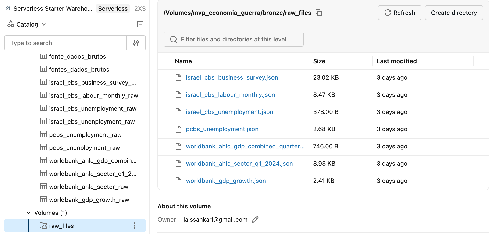

---

<a id="modelagem"></a>
### 3. Modelagem e Catálogo de Dados (Etapa 4.3)

**3.1 Modelo de dados**

A camada Gold trabalha com uma constelação de fatos. A escolha de usar a constelação de fatos foi feita porque os fatos da pesquisa possuem grãos diferentes e dimensões cruzadas. 


| Tabela fato | Grão (uma linha por...) | Perguntas |
|---|---|---|
| `fato_atividade_economica` | território × período (ano ou trimestre) × setor × fonte | 1, 2, 3 |
| `fato_pesquisa_negocios` | onda da pesquisa (mês) × recorte (distrito, setor ou porte) | 4 |
| `fato_indicador_mensal` | território × mês × fonte | 5 |

Colocar tudo em uma única tabela fato misturaria granularidades anuais, trimestrais e mensais e geraria colunas quase sempre nulas. As dimensões `dim_territorio`, `dim_periodo`, `dim_setor` e `dim_fonte` são compartilhadas; `dim_periodo` tem granularidade mista (anual, trimestral e mensal).

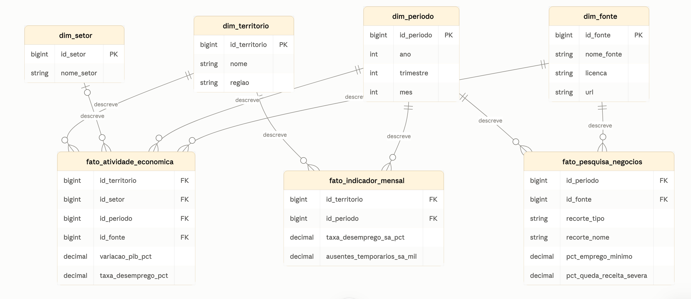

As dimensões têm `PRIMARY KEY` (chaves substitutas geradas com `GENERATED ALWAYS AS IDENTITY`) e as tabelas fato têm `FOREIGN KEY` informativas no Unity Catalog.

**3.2 Catálogo de dados — camadas Bronze e Silver**

**Catálogo navegável no Unity Catalog:** as **19 tabelas das três camadas** e **todas as suas 133 colunas** receberam descrição (`COMMENT ON TABLE` e `ALTER COLUMN ... COMMENT`). 

| Camada | Tabela | Conteúdo | Origem / transformação |
|---|---|---|---|
| Bronze | `worldbank_gdp_growth_raw` | PIB anual, como publicado | `worldbank_gdp_growth.json` |
| Bronze | `worldbank_ahlc_sector_raw` | PIB setorial Q1-2024, como publicado | `worldbank_ahlc_sector_q1_2024.json` |
| Bronze | `worldbank_ahlc_gdp_combined_raw` | PIB trimestral combinado | `worldbank_ahlc_gdp_combined_quarterly.json` |
| Bronze | `pcbs_unemployment_raw` | Desemprego anual palestino | `pcbs_unemployment.json` |
| Bronze | `israel_cbs_unemployment_raw` | Desemprego anual israelense | `israel_cbs_unemployment.json` |
| Bronze | `israel_cbs_labour_monthly_raw` | Desemprego e ausentes mensais (dessazonalizados) | `israel_cbs_labour_monthly.json` |
| Bronze | `israel_cbs_business_survey_raw` | Pesquisa de negócios em formato longo | `israel_cbs_business_survey.json` |
| Bronze | `fontes_dados_brutos` | Tabela de referência: catálogo das 7 fontes de dados brutos usadas (Etapa 4.1), inclusive as não ingeridas | Criada e populada manualmente no notebook 01 |
| Silver | `pib_padronizado` | PIB total anual e trimestral | União das 3 fontes de PIB; territórios padronizados; `CAST` para DECIMAL |
| Silver | `pib_setorial_padronizado` | PIB por setor | AHLC sem a linha de PIB total (evita duplicidade) |
| Silver | `desemprego_padronizado` | Desemprego anual | `UNION ALL` de PCBS e Israel CBS; nulos preservados |
| Silver | `pesquisa_negocios_padronizada` | Pesquisa de negócios em formato largo | Pivot por agregação condicional; onda convertida em ano/mês |
| Silver | `trabalho_mensal_padronizado` | Indicadores mensais de Israel | Tipagem; série dessazonalizada |
| Silver | `conflito_mensal_padronizado` | Eventos e fatalidades mensais | Semanal → mensal; Palestina separada em Gaza/Cisjordânia via `ADMIN1` |

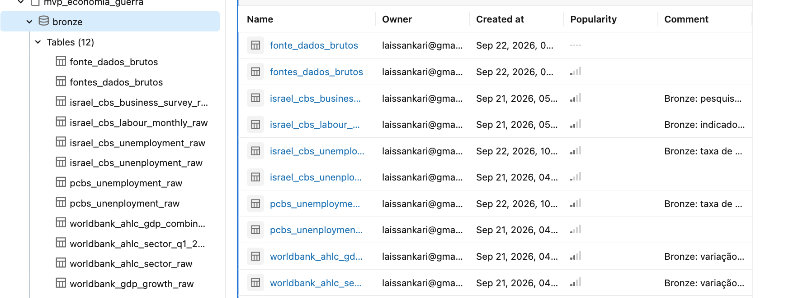

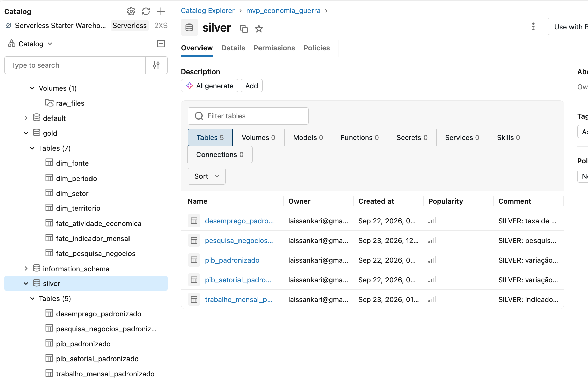

**3.3 Catálogo de dados — camada Gold**

**`dim_territorio`** — territórios analisados, incluindo territórios "agregados" como usado em algumas das fontes. 

| Coluna | Tipo | Descrição | Domínio | Linhagem |
|---|---|---|---|---|
| id_territorio | BIGINT | Chave substituta | PK, gerada automaticamente | Gold |
| nome | STRING | Nome padronizado | 'Israel', 'Cisjordania', 'Gaza', 'Cisjordania e Gaza (combinado)', 'Palestina (combinado)' | Nomes das fontes ("West Bank", "Gaza Strip", "Palestine"...) mapeados na Silver |
| regiao | STRING | Região geográfica | 'Oriente Medio' | Atribuída na Gold |

**`dim_periodo`** — tempo com granularidade mista.

| Coluna | Tipo | Descrição | Domínio | Linhagem |
|---|---|---|---|---|
| id_periodo | BIGINT | Chave substituta | PK | Gold |
| ano | INT | Ano | 2020–2025 | Fontes |
| trimestre | INT | Trimestre | 1–4; NULL em linhas anuais | Fontes trimestrais (AHLC) ou `quarter()` nas mensais |
| mes | INT | Mês | 1–12; NULL em linhas anuais e trimestrais | Linhas mensais jan/2023–dez/2024 geradas com `sequence` |

**`dim_setor`** — setores econômicos (classificação do relatório do World Bank).

| Coluna | Tipo | Descrição | Domínio | Linhagem |
|---|---|---|---|---|
| id_setor | BIGINT | Chave substituta | PK | Gold |
| nome_setor | STRING | Setor | 10 setores (Agriculture, Manufacturing, Construction, Wholesale and Retail Trade, Transportation and Storage, Financial and Insurance, Information and Communication, Services, Public Administration and Defense, Mining/Manufacturing/Electricity/Water) | `SELECT DISTINCT` de `pib_setorial_padronizado` |

**`dim_fonte`** — fontes dos dados e licença.

| Coluna | Tipo | Descrição | Domínio | Linhagem |
|---|---|---|---|---|
| id_fonte | BIGINT | Chave substituta | PK | Gold |
| nome_fonte | STRING | Fonte do dado | 5 fontes (World Bank WDI, World Bank AHLC, PCBS, Israel CBS, Israel CBS 380/2023) | Campo `fonte` dos arquivos brutos |
| licenca | STRING | Licença de uso | CC BY 4.0; CC BY 3.0 IGO; CBS Open License | Verificada manualmente em cada fonte |
| url | STRING | Link da fonte | URL | Registrada na coleta |

**`fato_atividade_economica`** — PIB total, PIB setorial e desemprego anual (Perguntas 1–3).

| Coluna | Tipo | Descrição | Domínio | Linhagem |
|---|---|---|---|---|
| id_territorio | BIGINT | FK → dim_territorio | — | JOIN por nome na Gold |
| id_setor | BIGINT | FK → dim_setor | NULL quando a linha é PIB total ou desemprego | JOIN por nome do setor |
| id_periodo | BIGINT | FK → dim_periodo | — | JOIN null-safe (`<=>`) no trimestre, restrito a linhas sem mês |
| id_fonte | BIGINT | FK → dim_fonte | — | JOIN por nome da fonte |
| variacao_pib_pct | DECIMAL(6,2) | Variação % do PIB (anual, ou trimestre contra mesmo trimestre do ano anterior) | Pode ser negativa; ≥ −100 | WDI e relatório AHLC |
| taxa_desemprego_pct | DECIMAL(6,2) | Taxa de desemprego anual | 0–100; NULL em Gaza/Palestina a partir de 2023 | PCBS e Israel CBS Table 1.1 |

**`fato_pesquisa_negocios`** — pesquisa emergencial do Israel CBS (Pergunta 4).

| Coluna | Tipo | Descrição | Domínio | Linhagem |
|---|---|---|---|---|
| id_territorio | BIGINT | FK → dim_territorio | Israel | Gold |
| id_periodo | BIGINT | FK → dim_periodo (mês da onda) | out/2023, nov/2023 | Onda convertida na Silver |
| id_fonte | BIGINT | FK → dim_fonte | Israel CBS 380/2023 | Gold |
| recorte_tipo | STRING | Tipo de recorte (dimensão degenerada) | 'nacional', 'distrito', 'setor', 'porte' | Campo `abrangencia` |
| recorte_nome | STRING | Valor do recorte | ex.: 'Sul', 'Construcao', '5_a_10' | Campo `categoria` |
| pct_emprego_minimo | DECIMAL(5,2) | % de negócios com até 20% da equipe pré-guerra ativa (proxy de fechado/quase fechado) | 0–100 | Pivot da métrica correspondente |
| pct_emprego_alto | DECIMAL(5,2) | % de negócios com 81% ou mais da equipe ativa | 0–100 | Pivot |
| pct_queda_receita_severa | DECIMAL(5,2) | % de negócios com queda de receita esperada acima de 50% | 0–100 | Pivot |
| pct_causa_demanda | DECIMAL(5,2) | % que aponta queda de demanda como principal causa | 0–100; só nacional/nov | Pivot |
| pct_causa_falta_trabalhadores | DECIMAL(5,2) | % que aponta falta de trabalhadores como principal causa | 0–100; só nacional/nov | Pivot |

**`fato_indicador_mensal`** — indicadores mensais (Pergunta 5).

| Coluna | Tipo | Descrição | Domínio | Linhagem |
|---|---|---|---|---|
| id_territorio | BIGINT | FK → dim_territorio | Israel | Gold |
| id_periodo | BIGINT | FK → dim_periodo (mensal) | jan/2023–dez/2024 | JOIN por ano e mês |
| id_fonte | BIGINT | FK → dim_fonte | Israel CBS | Gold |
| taxa_desemprego_sa_pct | DECIMAL(5,2) | Desemprego mensal dessazonalizado | 0–100 | Israel CBS Table 1.1 |
| ausentes_temporarios_sa_mil | DECIMAL(8,1) | Trabalhadores temporariamente ausentes, milhares, dessazonalizado | ≥ 0 | Israel CBS Table 1.4 |

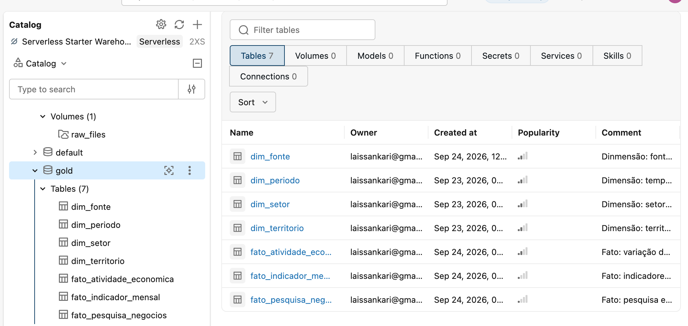

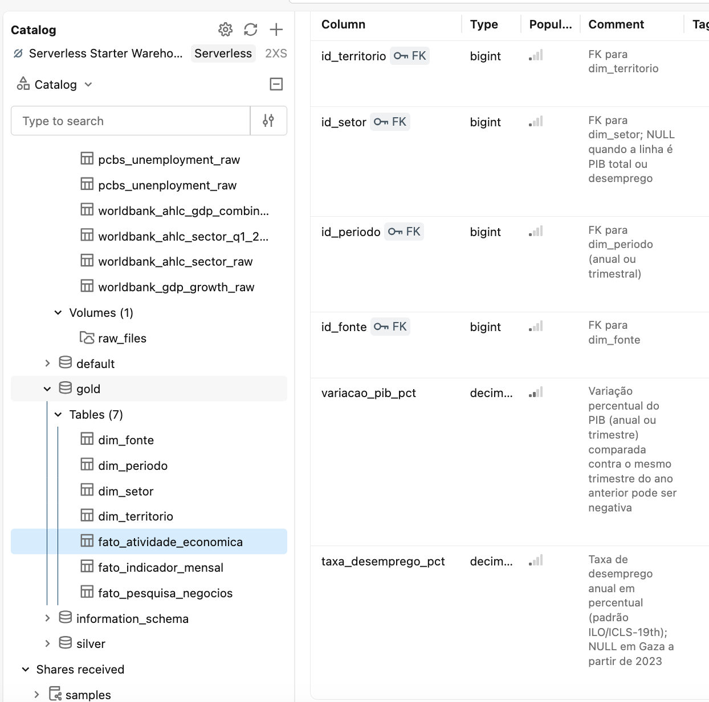

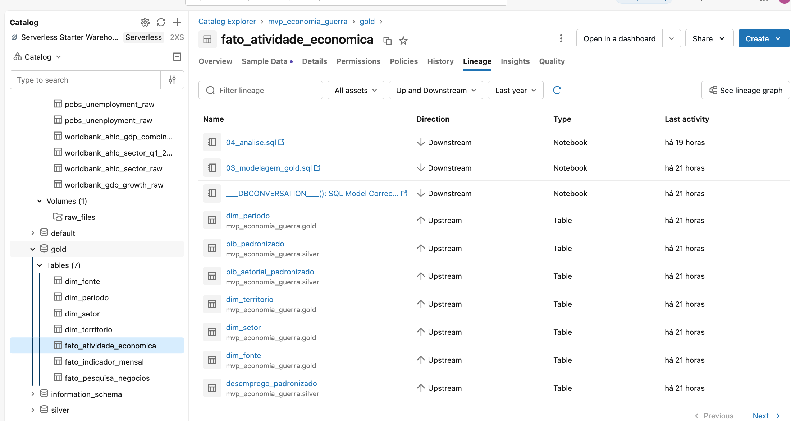


<a id="pipeline"></a>
### 4. Pipeline de Dados (Etapa 4.4)

O pipeline foi escrito inteiramente em SQL e dividido em quatro notebooks, um por etapa, executados em sequência:

```
notebooks_sql/
 ├── 01_ingestao_bronze.sql       → Volume + COPY INTO de todas as fontes (Bronze)
 ├── 02_transformacao_silver.sql  → limpeza, padronização e verificações de qualidade (Silver)
 ├── 03_modelagem_gold.sql        → dimensões, fatos, PK/FK e comentários (Gold)
 └── 04_analise.sql               → consultas que respondem às perguntas de negócio
```

**4.1 Bronze — `01_ingestao_bronze.sql`**

- Cria catálogo, schemas e Volume; carrega cada arquivo em uma tabela Delta com `COPY INTO`; analisa os dados brutos; registra descrições de tabelas e colunas.
- Preserva o dado como veio da fonte, com fonte e licença por linha; a idempotência do `COPY INTO` evita duplicação em reexecuções.
- Nenhum valor é alterado.

**Decisão de modelagem — tipagem na Bronze:** Decidiu-se por deixar o `COPY INTO` inferir os tipos automaticamente (`mergeSchema = true`) já na camada Bronze, porque os arquivos de origem são JSON pequenos e já validados linha a linha antes do upload e o risco de perda silenciosa de valor é baixo o suficiente para compensar já ter tipos previsíveis desde a primeira camada. Em um pipeline com arquivos maiores ou não validados previamente, a abordagem "tudo STRING na Bronze" seria mais segura, e fica citada aqui como boa prática alternativa e trabalho futuro.

**4.2 Silver — `02_transformacao_silver.sql`**
| Transformação | Por que | Impacto nos dados |
|---|---|---|
| Padronização de territórios com `CASE WHEN` | Cada fonte nomeia os territórios de forma diferente; sem isso, os JOINs da Gold não funcionariam| Valores não são alterados; rótulos unificados |
| `CAST` para DECIMAL/INT | Tipos inferidos do JSON variam (inteiro vs. decimal) | Tipagem consistente entre fontes |
| União das 3 fontes de PIB com coluna `trimestre` | Combinar a série anual longa com o detalhe trimestral por território | NULL em `trimestre` para dado anual |
| Exclusão da linha "Gross Domestic Product" da tabela setorial | Essa linha é o total, já incluído no PIB setorial | Evita contagem dupla |
| `UNION ALL` PCBS + Israel CBS | Mesma métrica (ILO/ICLS-19th) | Comparação direta entre territórios |
| Pivot da pesquisa de negócios (`MAX(CASE WHEN ...)`) | Formato longo/comprido dificulta consultas | Uma coluna por métrica; onda → ano/mês |
| Uso da série dessazonalizada | Evitar confundir feriados com efeito da guerra | Remove picos sazonais |
| Verificações de completude, unicidade, domínio e licença | Evidenciar a análise de qualidade | Consultas de checagem (resultados esperados documentados) |

**4.3 Gold — `03_modelagem_gold.sql`**
- Cria as 4 dimensões (PK com IDENTITY), as 3 tabelas fato via `CREATE TABLE AS SELECT` com JOINs, as FKs informativas e os comentários no Unity Catalog.
O modelo dimensional permite responder às perguntas com poucos JOINs e sem repetir textos soltos em cada linha.
O JOIN com `dim_periodo` usa igualdade null-safe (`<=>`) e o filtro `mes IS NULL`, garantindo que dados anuais casem apenas com períodos anuais e trimestrais apenas com trimestrais.

**4.4 Análise — `04_analise.sql`**
Consultas por pergunta, incluindo ranking com `RANK()`, comparações por agregação condicional, linha de base pré-guerra e correlação com `corr()` e defasagem com `LAG()`.

---

<a id="qualidade"></a>
### 5. Qualidade de Dados (Etapa 4.5)

A análise foi feita em duas etapas; perfilamento dos dados brutos no fim do notebook Bronze e verificações após a transformação no fim do notebook Silver. As consultas e os resultados esperados estão anotados nos próprios notebooks.

**5.1 Completude**

- Desemprego em Gaza e na Palestina (combinado): 6 de 18 registros do PCBS (33%) estão ausentes, todos de 2023 a 2025. Não é falha de transcrição; o próprio PCBS (Palestinian Central Bureau of Statistics) deixou de publicar os dados para Gaza, o que foi interpretado como indício de que a pesquisa se tornou inviável no território.
 Nesse caso, os dados foram mantidos como NULL (sem imputação) e discutidos como achado analítico.
- Esparsidade por desenho: nas tabelas fato, cada linha preenche apenas as métricas da sua fonte (ex.: linhas de PIB têm `taxa_desemprego_pct` NULL). A separação em três fatos por grão reduziu esse efeito.
- Negócios fechados: o Business Register do Israel CBS é confidencial, e não foi encontrada estatística equivalente para os territórios palestinos. Por isso, foi escolhido fazer o uso de uma métrica "proxy" oficial, que foi a pesquisa emergencial 380/2023. 

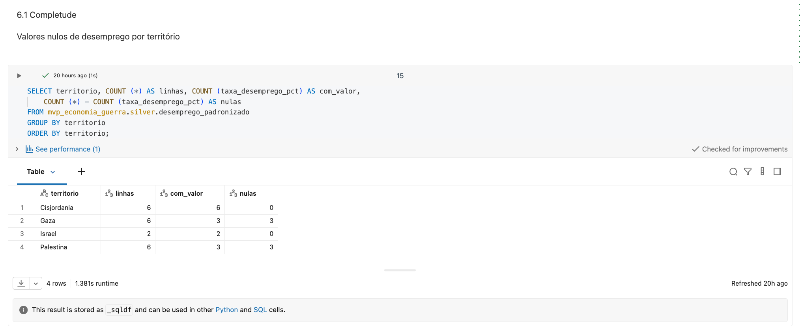

**5.2 Consistência**
- Nomes de território: o perfilamento da camada Bronze mostra cinco grafias diferentes entre fontes; "West Bank", "Gaza Strip", "Palestine", "West Bank and Gaza", "Israel", mapeadas para um padrão único na camada Silver.
- Linha de total misturada aos setores: a tabela setorial do World Bank traz a linha "Gross Domestic Product" junto dos setores. O perfilamento isola essas 2 linhas, que vão para a tabela de PIB total, evitando contar o total como um setor.
- Granularidade temporal mista: anual (WDI, PCBS), trimestral (AHLC) e mensal (Israel CBS). `dim_periodo` com granularidade mista e fatos separados por grão.
- Classificações setoriais incompatíveis: o relatório do World Bank usa setores próximos da ISIC; a pesquisa do CBS agrupa setores de outra forma (ex.: "high-tech e finanças"). Dessa forma, não foram forçados na mesma `dim_setor` (o que exigiria um mapeamento arbitrário); os setores israelenses ficaram como recorte degenerado em `fato_pesquisa_negocios`, e a comparação entre os lados é qualitativa.
- Métricas de natureza diferente: Percentual de negócios afetados (Israel) não é comparável numericamente com variação percentual do PIB setorial (Palestina). Isso foi explicitado na análise.

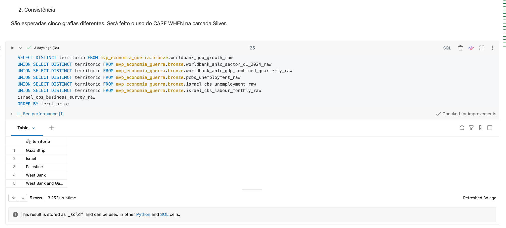

**5.3 Unicidade**
- Por serem transcritos manualmente, os dados foram verificados por chave natural (`GROUP BY ... HAVING COUNT(*) > 1`) em PIB, desemprego e trabalho mensal. O resultado esperado é que não ocorra nenhuma duplicata. O `COPY INTO` impede duplicação em reexecuções.

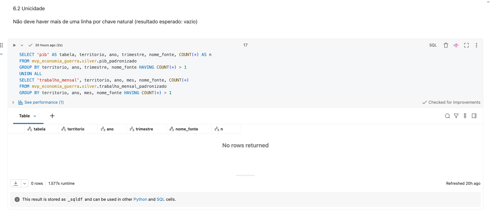

**5.4 Acurácia**
- Regras de domínio: desemprego entre 0 e 100, variação setorial ≥ −100% e percentuais da pesquisa entre 0 e 100 (consulta na camada Silver; resultado esperado vazio).
- Conferência aritmética na transcrição: na Table 1.4 (Israel), a soma das três categorias de ocupados bate com o total em todos os meses conferidos.
- Validação cruzada entre fontes independentes: o relatório do World Bank cita desemprego de 35% na Cisjordânia em junho/2024, da mesma ordem da média anual de 31,3% do PCBS. Em Israel, a média mensal dessazonalizada de 2024 (2,95%) é coerente com a taxa anual publicada (3,0%).
- Efeito sazonal confundido com efeito da guerra: no comunicado 380/2023, o setor "saúde, bem-estar, artes e outros serviços" piorou de outubro para novembro (42% → 62% com queda severa de receita). O próprio CBS atribui parte disso à sazonalidade (período pré-Hanucá/Chanucá) e à queda de procedimentos eletivos; o dado foi interpretado com essa ressalva.
- Dois níveis de confiança na transcrição do comunicado 380/2023. A fonte é em hebraico, com números embutidos em texto corrido e em 9 gráficos de barra, sem tabela central. Parte dos valores foi confirmada por uma frase explícita do texto ( "כ40%- ... ירידה לעומת 59%" confirma Sul: 59%→40%; Tel Aviv ~10%, Construção 73%→44%, Alimentação/Bebidas 71%→37%, High-tech/Finanças 9%). Outros três valores distritais — Haifa (39%→23%), Centro (38%→20%) e Jerusalém/Judeia e Samaria (42%→26%) — foram lidos diretamente das barras do Gráfico 2 do comunicado, sem uma frase equivalente no texto que os confirmasse de forma independente. Ambos os grupos de dados vêm da mesma fonte oficial (Central Bureau of Statistics); a diferença é apenas o grau de confirmação cruzada disponível dentro do próprio documento, e está sinalizada aqui para transparência, sem que isso tenha motivado a busca por outra fonte, já que todos os dados foram retirados das fontes oficiais do governo de Israel.


### Outliers
- Quedas de −93% a −99% nos setores de Gaza são extremas, mas representam valores reais e coerentes com a descrição do próprio relatório, que enfatiza que a economia estava "à beira do colapso total". 
- Picos sazonais na série original de ausentes em Israel: abril/2023 (614,8 mil, Pessach) e agosto/2023 (592,2 mil, férias) têm valores próximos ao pico da guerra. Sem tratamento, seriam confundidos com choques do conflito. Foi feito o uso exclusivo da série **dessazonalizada**, na qual abril/2023 cai para 331,0 mil e agosto para 311,5 mil.
- PIB palestino de 2025 (+4,34% no WDI) deve refletir estimativa/efeito de base após a queda de 2024; sinalizado na análise.

---

<a id="analise"></a>
### 6. Análise de Dados (Etapa 4.5)

**6.1 Variação do PIB por território e período**

**Anual (World Bank WDI):**

| Ano | Israel | Cisjordânia e Gaza (combinado) |
|---|---|---|
| 2022 | +6,36% | +4,08% |
| 2023 | +2,06% | −0,97% |
| **2024** | **+0,95%** | **−22,86%** |
| 2025 | +2,93% | +4,34% |

**Trimestral, contra o mesmo trimestre do ano anterior (World Bank, set/2024):**

| Território | Q4-2023 | Q1-2024 |
|---|---|---|
| Palestina (combinado) | −29% | −35% |
| Cisjordânia | — | −25% |
| Gaza | — | **−86%** |

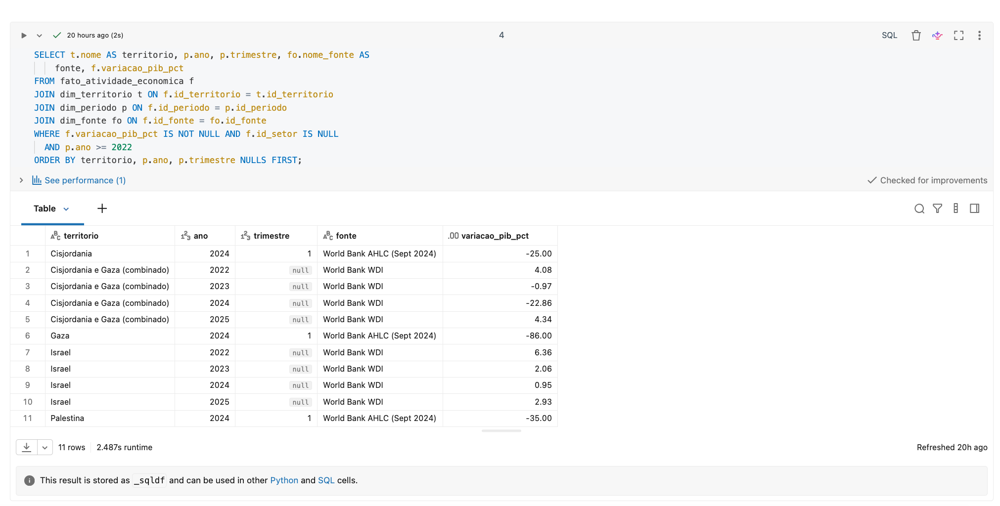

**Discussão:** Israel desacelerou fortemente (de +6,4% em 2022 para +1,0% em 2024), mas não entrou em recessão anual. No lado palestino, a queda de 2024 é a maior de toda a série desde 1961, demonstrando que o território foi fortemente afetado pela eclosão do conflito. O dado trimestral mostra que essa média esconde uma assimetria interna enorme: a Cisjordânia contraiu 25% e Gaza 86% no Q1-2024 (assimetria condiz com intensidade do conflito por território). A piora de −29% para −35% entre Q4-2023 e Q1-2024 indica que o choque se aprofundou em vez de se dissipar. 

**Limitação:** não há PIB trimestral de 2024 comparável para Israel na base coletada, então a comparação trimestral é apenas "intra-palestina". 

**6.2 Setores mais e menos afetados —** respondida para os territórios palestinos; qualitativa para Israel

| Setor (Q1-2024 vs Q1-2023) | Cisjordânia | Gaza | Diferença (p.p.) |
|---|---|---|---|
| Construção | **−42%** | **−99%** | −57 |
| Transporte e armazenagem | −32% | −97% | −65 |
| Manufatura | −31% | −95% | −64 |
| Mineração, manufatura, eletricidade e água | −29% | −95% | −66 |
| Comércio atacadista e varejista | −27% | −96% | −69 |
| Serviços | −24% | −67% | −43 |
| Informação e comunicação | −18% | −93% | −75 |
| Atividades financeiras e seguros | −14% | −98% | **−84** |
| Agricultura, silvicultura e pesca | −11% | −93% | −82 |
| Administração pública e defesa | −10% | −88% | −78 |
| **PIB total** | **−25%** | **−86%** | −61 |


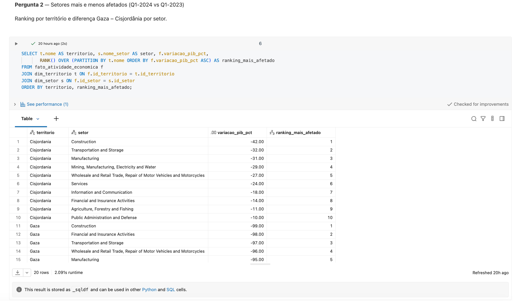

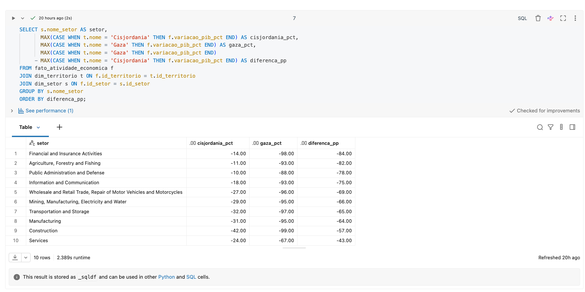

**Discussão:** na Cisjordânia, os setores mais atingidos foram construção (−42%) e transporte (−32%), ligados à perda de acesso ao mercado de trabalho israelense e às restrições de circulação; administração pública (−10%) e agricultura (−11%) foram os mais resilientes. Em Gaza, todos os setores caíram mais de 60%. A coluna de diferença revela o ponto mais importante; as maiores diferenças entre os dois territórios estão justamente nos setores que resistiram na Cisjordânia (finanças, agricultura, administração pública). Ou seja, em Gaza não houve setor protegido, o que condiz com os dados empíricos sobre a intensidade do conflito, que afetou a região de forma mais intensa que a Cisjordânia. 

**Contexto do lado israelense** (citado de Debowy, Epstein e Weiss, Taub Center, dez/2024, com dados do CBS): o padrão foi de realocação, não colapso. Entre os primeiros semestres de 2023 e 2024, saúde (+34 mil empregos) e educação (+22 mil) cresceram, enquanto hotelaria e alimentação (−19 mil) e informação e comunicação fora do high-tech (−15 mil) encolheram. O saldo total foi de +33 mil vagas, contra +165 mil no mesmo intervalo dos dois anos anteriores. Israel foi, desse modo, menos afetada que as regiões da Cisjordânia e de Gaza. 

**6.3 Evolução da taxa de desemprego** respondida (exceto Gaza após 2022)

| Território | 2022 | 2023 | 2024 | Variação 2023→2024 |
|---|---|---|---|---|
| Israel | — | 3,4% | **3,0%** | −0,4 p.p. |
| Cisjordânia | 13,1% | 18,3% | **31,3%** | +13,0 p.p. |
| Gaza | 45,3% | sem dado | sem dado | — |

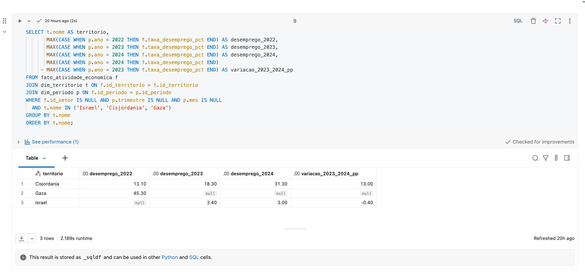


**Discussão:** em Israel, o desemprego formal teve uma baixa; na Cisjordânia, mais que dobrou em dois anos (13,1% → 31,3%). Em Gaza, a interrupção da série oficial é, por si só, evidência da severidade do choque sofrido durante a eclosão do conflito. A Pergunta 5 mostra que a estabilidade israelense no desemprego esconde uma disrupção real que aparece em outro indicador.

**6.4 Negócios afetados** respondida via proxy oficial (Israel); sem equivalente palestino

> O Business Register israelense é confidencial. A métrica usada é da pesquisa emergencial do CBS (amostra de 1.721 empresas, com 78% de resposta, representando 67.931 negócios com + 5 empregados).

**Nacional:** 

- Negócios em emprego mínimo (que ainda tem 20% da equipe pré-guerra ativa) caíram de **37% (out/2023) para 22% (nov/2023)**; os com emprego alto ( que têm 81% ou mais da equipe ativa) subiram de 24% para 37%. Em novembro, 49% apontaram queda de demanda como principal causa da queda da receita e 19%, a falta de trabalhadores.

| Distrito | Emprego mínimo out → nov | Queda de receita >50% out → nov |
|---|---|---|
| Sul | 59% → 40% | 67% → 39% |
| Jerusalém e Judeia/Samaria | 42% → 26% | 52% → 43% |
| Haifa | 39% → 23% | 30% → 28% |
| Centro | 38% → 20% | 45% → 33% |
| Norte | 32% → 27% | 64% → 42% |
| Tel Aviv | 24% → 10% | 52% → 37% |

| Setor | Queda de receita >50% out → nov | Emprego mínimo (nov) |
|---|---|---|
| Construção | 73% → 44% | 34% (62% em out) |
| Alimentação, bebidas e eventos | 71% → 37% | 21% |
| Indústria | 50% → 38% | 24% |
| Serviços (exceto high-tech) | 45% → 42% | 25% |
| Saúde, bem-estar, artes e outros | 42% → **62%** | 17% |
| Comércio | 41% → 19% | 17% |
| High-tech e finanças | 30% → 9% | 7% |

**Por porte (nov/2023):** 26% das empresas com 5–10 empregados estavam em emprego mínimo, contra 6% das com mais de 250.

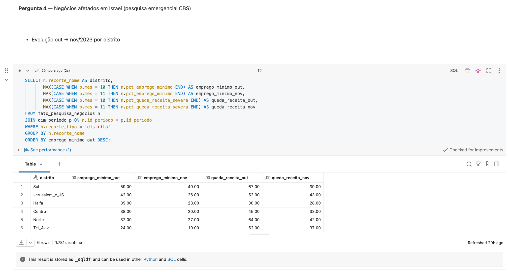

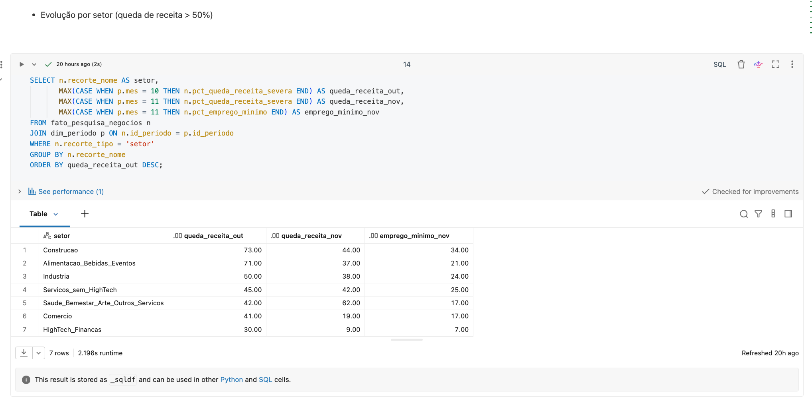

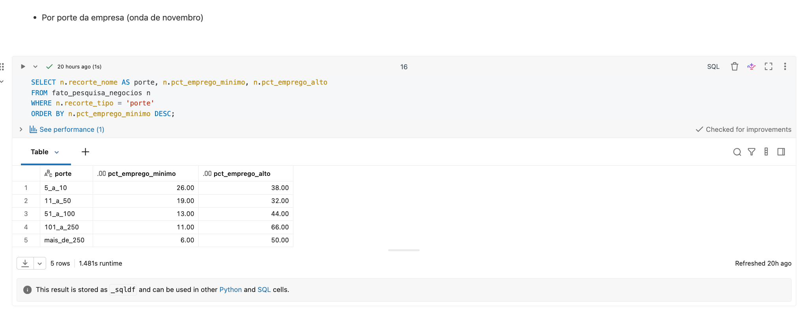

**Discussão:** o impacto sobre os negócios israelenses foi forte no primeiro mês, concentrado no Sul, na área de construção (falta de trabalhadores palestinos, segundo o próprio CBS) e em alimentação, e caiu rapidamente em poucas semanas. Pequenas empresas foram muito mais afetadas que as grandes. O Norte recuperou menos (32% → 27%) que os demais distritos, coerente com a continuidade das hostilidades na fronteira norte (fronteira Síria/Líbano). **Comparação qualitativa:** Os recortes israelenses mais afetados mostram recuperação em semanas, enquanto nenhum indicador palestino coletado mostra recuperação no mesmo período. Alguns, inclusive, deixaram de ser coletados. 

**6.5 Picos do conflito × atividade** 

**5a. Linha de base pré-guerra (Israel CBS, séries mensais dessazonalizadas).** Linha de base = média jan–set/2023: **292,0 mil ausentes** e **3,56% de desemprego**.

| Mês | Ausentes temporários (mil) | Desvio vs. linha de base | Desemprego |
|---|---|---|---|
| set/2023 | 256,9 | −12% | 3,3% |
| **out/2023** | **683,0** | **+134%** | 3,2% |
| nov/2023 | 607,9 | +108% | 2,9% |
| dez/2023 | 520,9 | +78% | 3,2% |
| jan/2024 | 396,7 | +36% | 3,3% |
| jun/2024 | 315,4 | +8% | 3,1% |
| set/2024 | 371,2 | +27% | 2,7% |
| Média de 2024 | 342,7 | **+17%** | 2,95% |


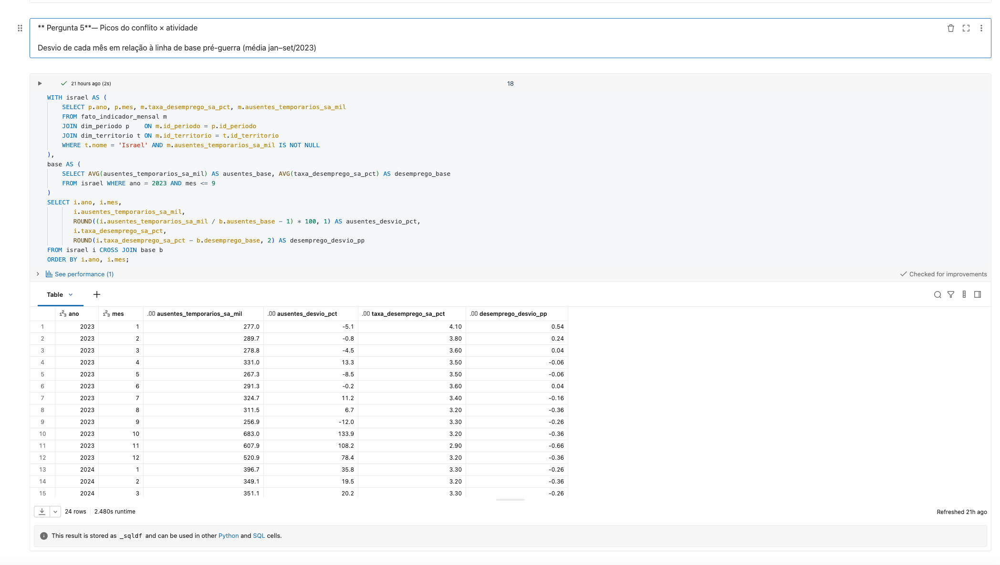

**Discussão:** Existe uma coincidência temporal nítida entre o início da guerra e o maior choque da coleta dos dados; os ausentes do trabalho mais que dobraram em um mês (+166% de setembro para outubro de 2023) e decaíram gradualmente, permanecendo acima do pré-guerra durante todo 2024. **A taxa de desemprego não capta esse pico**, na realidade, ela até caiu. Isso acontece porque reservistas convocados e trabalhadores de negócios temporariamente fechados continuam contados como empregados. O relatório do Taub Center (dados do CBS) confirma o mecanismo: a medida ampla de desemprego chegou a 9,6% em outubro/2023, e a ausência por serviço de reserva atingiu 3,4% dos empregados (média de 150 mil) em dezembro/2023. A nova alta em setembro/2024 é compatível com a escalada na fronteira norte naquele período — **hipótese que fica para trabalho futuro** testar contra dados de intensidade do conflito.

**Lado palestino:** não existem dados mensais comparáveis na base coletada (ou dados de fácil acesso). Os indicadores disponíveis (PIB trimestral de −29% para −35%; interrupção da pesquisa de emprego em Gaza) mostram um choque persistente e crescente, que não segue o padrão de pico seguido de recuperação observado em Israel. Com apenas dois pontos trimestrais, não é possível calcular correlação estatística para a região. 

**5b. Correlação estatística com a intensidade do conflito — não realizada nesta versão.** Medir a intensidade mês a mês exigiria uma fonte de dados sobre eventos de conflito (ex.: registros georreferenciados de ataques e fatalidades), que não foi incorporada por decisão de escopo, priorizando entregar o pipeline completo de ponta a ponta com as fontes já tratadas. Assim, a Pergunta 5 fica **parcialmente respondida**: a coincidência temporal entre o início da guerra e o choque está demonstrada, mas não a relação estatística entre variações de intensidade e variações de atividade.

**6.6 Discussão geral**

Conforme os resultados da análise dos dados apontam, a guerra afetou os três territórios, mas não de maneira proporcional. 

Israel sofreu um choque agudo e concentrado em um período curto (out–dez/2023) e em regiões específicas (Sul e Norte), com recuperação rápida nos negócios, desaceleração do PIB sem recessão anual e desemprego formal estável. O impacto persistente aparece em indicadores menos óbvios, como ausência do trabalho e realocação setorial do emprego. A Cisjordânia teve contração severa (−25% no PIB do Q1-2024) e desemprego mais que dobrado, puxados por construção e transporte, com alguns setores relativamente resilientes. Já Gaza, que foi o território mais afetado, passou por um colapso generalizado (−86% no PIB, todos os setores acima de −60%), a ponto de interromper a produção de estatísticas oficiais.

Os indicadores de fontes independentes se reforçam (PIB, desemprego e pesquisas de negócios apontam na mesma direção em cada território), o que dá robustez às conclusões apesar das limitações de granularidade e de comparabilidade documentadas na seção de Qualidade de Dados.

---

<a id="autoavaliacao"></a>
### 7. Autoavaliação

Das cinco perguntas, quatro foram respondidas com dados oficiais (a Pergunta 4 por meio de uma fonte de proxy e apenas para Israel) e a quinta foi respondida parcialmente: a coincidência temporal entre o início do conflito e o choque no mercado de trabalho israelense ficou demonstrada, mas o teste estatístico de correlação com a intensidade do conflito ficou como trabalho futuro, por decisão de priorizar um pipeline completo de ponta a ponta.

A maior dificuldade encontrada foi a assimetria das fontes, porque os dados israelenses são mais granulares (mensais, por distrito) e os dados palestinos mais agregados e com lacunas, o que limitou comparações diretas.

A fonte de desemprego mensal de Israel (Israel CBS, Labour Force Survey — Table 1.1) foi a mais difícil de interpretar por uma combinação de fatores que não apareceram nas demais fontes. Dentre elas, destaca-se o texto bilíngue (inglês/hebraico), que tornou a leitura mais lenta e sujeita a erro de transcrição.

Além desse fator, nenhuma coluna do texto estava pronta, diferente do PCBS, que publica as taxas já calculadas. Nesse caso, foi preciso identificar que a taxa de desemprego vinha de uma divisão entre duas colunas (pessoas desempregadas ÷ força de trabalho total), cada uma delas ainda replicada em três versões (dado original, dessazonalizado e de tendência), exigindo decidir qual das três usar (optou-se pela dessazonalizada, para não confundir sazonalidade com efeito da guerra, como discutido em Outliers).

Ainda relacionado à coleta dos dados, os dados de Israel vinham em tabelas espalhadas em arquivos separados, sem um índice central. Os arquivos têm nomes como tab01_01.pdf e tab01_04.pdf; a existência da Table 1.1 (a tabela usada no trabalho e a que continha a taxa de desemprego) só foi descoberta ao notar, no rodapé de outra tabela já obtida, uma nota citando "percentages ... in Table 1.1". Isso motivou uma conferência aritmética adicional, não realizada nas outras fontes.

Por outro lado, a pesquisa de negócios do CBS (comunicado 380/2023) trouxe uma dificuldade diferente da Table 1.1, mas igualmente relevante: o documento é inteiramente em hebraico e os números não estão organizados numa tabela central. Isso obrigou a classificar cada valor por nível de confiança na extração: alguns números têm uma frase explícita do texto confirmando o valor lido no gráfico; três valores distritais (Haifa, Centro e Jerusalém/Judeia e Samaria) vieram só da leitura da barra do gráfico, sem confirmação textual independente. Decidiu-se manter a fonte e sinalizar essa diferença de confiança na Qualidade de Dados, em vez de buscar uma fonte alternativa. O Business Register confidencial do CBS já havia eliminado a opção de um dado mais direto, e qualquer fonte alternativa teria a mesma limitação de ser um recorte da mesma pesquisa.

Além dessas dificuldades, ficou evidente a importância de definir as perguntas antes de buscar dados, de desconfiar de indicadores "óbvios" (o desemprego israelense escondia o choque visível nos ausentes) e de tratar ausência de dado e licença como parte da análise.

**Trabalhos futuros:**
- Buscar e incorporar uma fonte de intensidade do conflito (ex.: registros georreferenciados de eventos armados) para concluir a correlação da Pergunta 5, testando também defasagens temporais.
- Automatizar a ingestão do WDI pela API do World Bank.
- Incorporar as demais ondas da pesquisa de negócios do CBS (dez/2023, mar/2024) para estender a série.
- Buscar indicadores mensais palestinos (ex.: índices da Autoridade Monetária Palestina) para permitir correlação também desse lado.
- Criar um dashboard no Databricks SQL com as principais séries.


<a id="referencias"></a>
### Referências

- World Bank. World Development Indicators — GDP growth (annual %). Data360. Licença CC BY 4.0.
- World Bank (2024). *Impacts of the Conflict in the Middle East on the Palestinian Economy — September 2024 Update*. Licença CC BY 3.0 IGO.
- Palestinian Central Bureau of Statistics (2025). *Database of Labor Force Survey, 2000–2025*. Ramallah. Licença CC BY 4.0.
- Israel Central Bureau of Statistics. Labour Force Survey — Tables 1.1 e 1.4 (2023–2024). CBS Open License.
- Israel Central Bureau of Statistics (2023). *Struggles of Business During Operation Swords of Iron: Data from a Flash Survey, November 2023*. Comunicado 380/2023. CBS Open License.
- Debowy, M., Epstein, G. S., & Weiss, A. (2024). *The Labor Market in Israel in 2024 in the Shadow of War*. Taub Center for Social Policy Studies in Israel. https://doi.org/10.5281/zenodo.14568425
